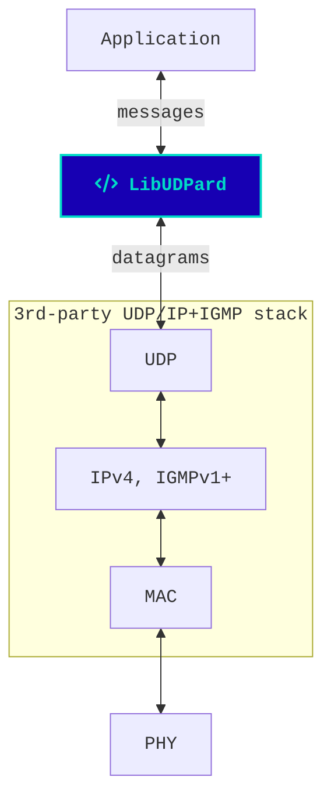

# Cyphal/UDP transport in C

-----

LibUDPard is a robust implementation of the Cyphal/UDP transport layer in C99/C11 for high-integrity real-time systems.

[Cyphal](https://opencyphal.org) is an open technology for real-time intravehicular distributed computing and
communication based on modern networking standards (Ethernet, CAN FD, etc.).
It was created to address the challenge of on-board deterministic computing and data distribution in
next-generation intelligent vehicles: manned and unmanned aircraft, spacecraft, robots, and cars.

## Features

- Zero-copy RX pipeline -- payload is moved from the NIC driver all the way to the application without copying.
- ≤1-copy TX pipeline with deduplication across multiple interfaces and scattered input buffer support.
- Support for redundant network interfaces with seamless interface aggregation and zero fail-over delay.
- Robust message reassembler supporting highly distorted datagram streams:
  out-of-order fragments, fragment/message deduplication, interleaving, variable MTU, ...
- Heap not required (but supported); the library can be used with fixed-size block pool allocators.
- Detailed time complexity and memory requirement models for the benefit of real-time high-integrity applications.
- Scalable: designed to handle thousands of subjects and hundreds of concurrent transfers with minimal resources.
- Runs anywhere out of the box, including extremely resource-constrained baremetal environments with ~100K ROM/RAM.
  No porting required.
- Partial MISRA C compliance (reach out to <https://forum.opencyphal.org>).
- Full implementation in a single C file with less than 2k lines of straightforward C99!
- Extensive verification suite.

## Usage

An application using this library will need to provide a third-party UDP/IP stack with multicast/IGMP support
(TCP not needed).
In the most straightforward case, the network layer can be based on the standard Berkeley socket API
or a lightweight embedded stack such as LwIP.

To integrate the library into your application, simply copy `udpard.c` and `udpard.h` from `libudpard/`
into your project tree, or add this entire repository as a submodule;
also ensure you have [`cavl2.h`](https://github.com/pavel-kirienko/cavl) somewhere in your include paths.

The library contains only one translation unit named `udpard.c`; no special compiler options are needed to build it.
The library should be compatible out of the box with all conventional computer architectures where a
standards-compliant C99 compiler is available.

**Read the API docs in [`libudpard/udpard.h`](libudpard/udpard.h).**

## Revisions

### v3.0 -- WORK IN PROGRESS

The library has been redesigned from scratch to support Cyphal v1.1, named topics, and reliable transfers.
No porting guide is provided since the changes are too significant;
please refer to the new API docs in `libudpard/udpard.h`.

### v2.0

- Updating from LibUDPard v1 to v2 involves several significant changes to improve memory management and payload handling.
- Please follow `MIGRATION_v1.x_to_v2.0.md` guide (available in v2 tree).

### v1.0

Initial release.
